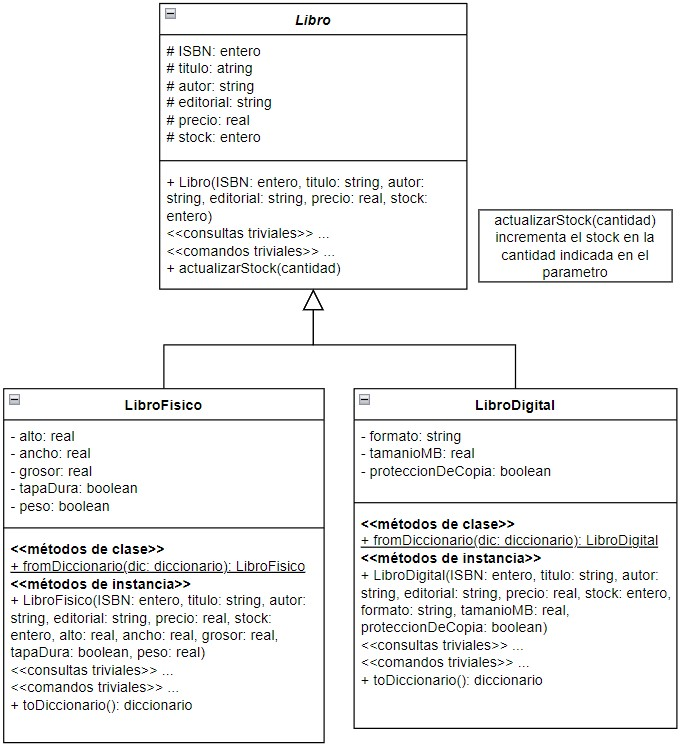

# Segundo parcial - Tema 3

## API de libros para la Taberna de Moe

Moe desea implementar en su taberna un sector dedicado a los hijos de sus clientes, y a pedido de Lisa incorporará material de lectura tanto en formato físico como digital.
Para ello, Moe necesita una API que le permita gestionar los libros.

- Los libros tienen un ISBN que los identifica, un título, el autor, la editorial, un precio y una cantidad en stock. 
- Los libros físicos también poseen datos sobre sus dimensiones: alto, ancho y grosor, si posee tapa dura o no, y su peso.
- Los libros digitales mantienen información del formato del libro, su tamaño en MB y si poseen protección de copia o no.

Los libros están modelados de la siguiente manera:

### Tarea

Moe comenzó a desarrollar la API pero no la terminó. 

1. Completá el código que falta para que la API funcione. 
2. Corregí los errores que cometió Moe. Donde corrijas un error agregá un comentario indicando el error corregido.

### Descripción de la API

La API de libros debe permitir realizar las siguientes operaciones:

1. **Crear un libro**: Crear un nuevo libro físico o digital proporcionando los atributos necesarios como ISBN, título, autor, editorial, precio, stock, y otros específicos de cada tipo de libro.
2. **Obtener todos los libros**: Recuperar una lista de todos los libros almacenados en el sistema.
3. **Obtener un libro por ISBN**: Recuperar los detalles de un libro específico utilizando su ISBN.
4. **Actualizar un libro**: Modificar los atributos de un libro existente.
5. **Eliminar un libro**: Eliminar un libro del sistema utilizando su ISBN.

### Requisitos

- Revisa el código existente y completa las funciones faltantes.
- Asegurate de que todas las operaciones CRUD funcionen correctamente. Para ello deberás crear el entorno virtual, activarlo e instalarle Flask.
- Corregí cualquier error que encuentres en la implementación actual y documentá los cambios realizados.

¡Buena suerte y manos a la obra!